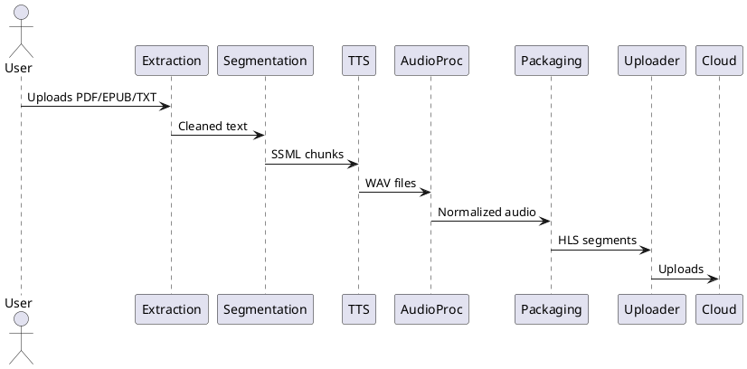

# Audiobook Creation Pipeline

## Project Overview
This repository provides a fully containerized, end-to-end audiobook creation pipeline. It extracts text from documents, segments and annotates it, synthesizes speech using GPU-accelerated TTS, post-processes audio, packages it for streaming, and uploads the result to cloud storage. All stages are orchestrated via Docker Compose and are Windows/NVIDIA GPU compatible.

## Prerequisites
- **Windows 10/11** with [Docker Desktop](https://www.docker.com/products/docker-desktop/) (WSL2 backend recommended)
- **NVIDIA GPU** (e.g., RTX 3090) with [NVIDIA drivers](https://www.nvidia.com/Download/index.aspx)
- [NVIDIA Container Toolkit](https://docs.nvidia.com/datacenter/cloud-native/container-toolkit/install-guide.html#windows)
- AWS credentials (for S3 upload) or [rclone](https://rclone.org/) config for other remotes
- (Optional) Azure OCR credentials for image-based PDFs

## Quickstart
```sh
git clone https://github.com/your-org/audiobook-pipeline.git
cd audiobook-pipeline
copy config\docker\.env.example config\.env # Edit as needed
docker compose up --build
```

To run the pipeline on a sample file:
```sh
docker compose run --rm uploader python /src/upload.py --input /data/output --bucket my-bucket
```

## Directory Structure
```
.
├── README.md
├── docker-compose.yml
├── LICENSE
├── CONTRIBUTING.md
├── config/
│   ├── pipeline.yaml
│   └── docker/.env.example
├── services/
│   ├── extraction/
│   ├── segmentation/
│   ├── tts/
│   ├── audioproc/
│   ├── packaging/
│   └── uploader/
├── src/
│   ├── extract.py
│   ├── segment.py
│   ├── tts.py
│   ├── postproc.py
│   ├── package.py
│   └── upload.py
├── utils/
│   └── concurrency.py
└── tests/
    └── test_pipeline.py
```

## Configuration
- **Voices, rates, chunk sizes:** Edit `config/pipeline.yaml`
- **AWS/rclone credentials:** Place in `config/docker/.env` (see `.env.example`)
- **Azure OCR:** Add keys to `pipeline.yaml` if using image-based extraction

## Dataflow Diagram


## Example pipeline.yaml
```yaml
stages:
  - extraction
  - segmentation
  - tts
  - postproc
  - packaging
  - upload
chunk_size: 1000
ssml:
  break: 500ms
  emphasis: moderate
voices:
  default: en-US-amy
  rate: 1.0
azure_ocr:
  key: "<your-azure-key>"
  endpoint: "<your-azure-endpoint>"
```

## Windows & GPU Setup
- Ensure Docker Desktop is running with WSL2 backend
- Install NVIDIA drivers and Container Toolkit
- In Docker Desktop: Settings > Resources > enable GPU support
- Use Windows-style paths for volume mounts (e.g., `C:\Users\...`)

## License
Apache 2.0

## Contributing
See CONTRIBUTING.md

---

### How to Run the Full Pipeline on Windows with GPU Support
1. Install all prerequisites (see above).
2. Clone this repo and copy/edit the `.env` file.
3. Start the pipeline: `docker compose up --build`
4. Place your input files in the mounted input directory (see `docker-compose.yml`).
5. Monitor logs and progress bars in the terminal.
6. Output will appear in the output directory and be uploaded to your configured remote. 