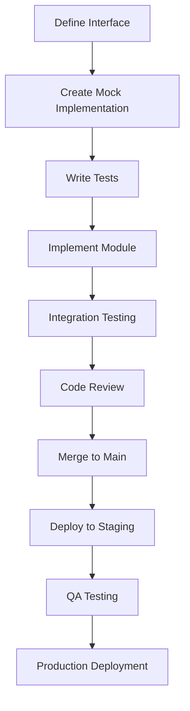

# Development Workflow & Deployment Guide

This document outlines the complete development workflow, deployment strategy, and operational procedures for the modular PWA audiobook application.

---

## 1. Development Environment Setup

### Prerequisites
```bash
# Required tools
- Node.js 18+ (with npm 9+)
- Git 2.30+
- Docker 24+ (for local services)
- VSCode with recommended extensions

# Recommended VSCode Extensions
- TypeScript and JavaScript Language Features
- ESLint
- Prettier
- Jest Runner
- Thunder Client (API testing)
- PWA Studio
```

### Project Initialization
```bash
# 1. Clone and setup
git clone <repository-url>
cd audiobook-pwa
npm install

# 2. Setup environment
cp .env.example .env.local
# Edit .env.local with your configuration

# 3. Start development services
docker-compose up -d  # Start backend services
npm run dev           # Start Next.js development server

# 4. Verify setup
npm run test:unit     # Run unit tests
npm run lint          # Check code quality
npm run type-check    # Verify TypeScript
```

### Development Scripts
```json
{
  "scripts": {
    "dev": "next dev",
    "build": "next build",
    "start": "next start",
    "test:unit": "jest --watch",
    "test:integration": "jest --config=jest.integration.config.js",
    "test:e2e": "playwright test",
    "test:all": "npm run test:unit && npm run test:integration && npm run test:e2e",
    "lint": "next lint",
    "lint:fix": "next lint --fix",
    "type-check": "tsc --noEmit",
    "format": "prettier --write .",
    "analyze": "ANALYZE=true npm run build",
    "storybook": "storybook dev -p 6006"
  }
}
```

---

## 2. Modular Development Workflow

### Module Development Process


### Phase 1: Core Foundation (Week 1)
**Day 1-2: Setup & Interfaces**
```bash
# Team Lead (1 person)
- Setup project structure
- Define base interfaces
- Configure CI/CD pipeline
- Setup testing infrastructure

# Tasks:
git checkout -b setup/project-foundation
mkdir -p src/{components,lib,hooks,stores,types}
# Create base interface files
git commit -m "feat: initial project structure and interfaces"
```

**Day 3-5: Parallel Module Development**
```bash
# Developer 1: Authentication Module
git checkout -b module/auth-system
# Implement authentication interfaces
# Create auth components and hooks
# Write unit tests

# Developer 2: UI Framework
git checkout -b module/ui-framework
# Implement design system
# Create common components
# Setup Tailwind configuration

# Developer 3: API Client
git checkout -b module/api-client
# Create HTTP client wrapper
# Implement error handling
# Setup React Query integration

# Developer 4: Navigation & Layout
git checkout -b module/navigation
# Create app layout
# Implement routing
# Setup responsive design
```

### Phase 2: Core Features (Week 2)
**Parallel Development Tasks**
```bash
# Developer 1: Library Management
git checkout -b module/library-management
# Implement book listing
# Create search and filter
# Add status monitoring

# Developer 2: File Upload
git checkout -b module/file-upload
# Create upload interface
# Implement progress tracking
# Add drag-and-drop

# Developer 3: Audio Player
git checkout -b module/audio-player
# Basic audio playback
# Progress tracking
# Volume controls

# Developer 4: Data Management
git checkout -b module/data-management
# React Query setup
# Optimistic updates
# Background sync
```

### Branch Management Strategy
```bash
# Branch naming convention
feature/module-name-description
bugfix/issue-description
hotfix/critical-fix-description

# Example workflow
git checkout -b feature/audio-player-controls
# Make changes
git add .
git commit -m "feat(audio): add playback controls with keyboard shortcuts"
git push origin feature/audio-player-controls
# Create pull request
```

---

## 3. Code Quality & Standards

### TypeScript Configuration
```json
// tsconfig.json
{
  "compilerOptions": {
    "target": "es5",
    "lib": ["dom", "dom.iterable", "es6"],
    "allowJs": true,
    "skipLibCheck": true,
    "strict": true,
    "forceConsistentCasingInFileNames": true,
    "noEmit": true,
    "esModuleInterop": true,
    "module": "esnext",
    "moduleResolution": "node",
    "resolveJsonModule": true,
    "isolatedModules": true,
    "jsx": "preserve",
    "incremental": true,
    "plugins": [
      {
        "name": "next"
      }
    ],
    "baseUrl": ".",
    "paths": {
      "@/*": ["./src/*"],
      "@/components/*": ["./src/components/*"],
      "@/lib/*": ["./src/lib/*"],
      "@/hooks/*": ["./src/hooks/*"],
      "@/types/*": ["./src/types/*"]
    }
  },
  "include": ["next-env.d.ts", "**/*.ts", "**/*.tsx", ".next/types/**/*.ts"],
  "exclude": ["node_modules"]
}
```

### ESLint Configuration
```json
// .eslintrc.json
{
  "extends": [
    "next/core-web-vitals",
    "@typescript-eslint/recommended",
    "plugin:react-hooks/recommended",
    "plugin:jsx-a11y/recommended"
  ],
  "plugins": ["@typescript-eslint", "react-hooks", "jsx-a11y"],
  "rules": {
    "@typescript-eslint/no-unused-vars": "error",
    "@typescript-eslint/no-explicit-any": "warn",
    "react-hooks/rules-of-hooks": "error",
    "react-hooks/exhaustive-deps": "warn",
    "jsx-a11y/anchor-is-valid": "off",
    "prefer-const": "error",
    "no-console": "warn"
  }
}
```

### Prettier Configuration
```json
// .prettierrc
{
  "semi": true,
  "trailingComma": "es5",
  "singleQuote": true,
  "printWidth": 100,
  "tabWidth": 2,
  "useTabs": false,
  "bracketSpacing": true,
  "arrowParens": "avoid",
  "endOfLine": "lf"
}
```

---

## 4. Testing Strategy Implementation

### Test Organization
```bash
# Test file structure
src/
├── components/
│   ├── ui/Button/
│   │   ├── Button.tsx
│   │   ├── Button.test.tsx
│   │   └── Button.stories.tsx
│   └── features/
│       ├── auth/
│       │   ├── LoginForm.tsx
│       │   ├── LoginForm.test.tsx
│       │   └── LoginForm.integration.test.tsx
├── lib/
│   ├── auth/
│   │   ├── authClient.ts
│   │   └── authClient.test.ts
└── e2e/
    ├── auth.spec.ts
    ├── library.spec.ts
    └── audio-player.spec.ts
```

### Test Commands
```bash
# Run tests for specific module
npm run test:unit -- --testPathPattern=auth
npm run test:integration -- --testPathPattern=library
npm run test:e2e -- --grep="audio player"

# Run tests with coverage
npm run test:unit -- --coverage
npm run test:integration -- --coverage --coverageDirectory=coverage-integration

# Run tests in CI mode
npm run test:all -- --ci --watchAll=false
```

---

## 5. Continuous Integration Pipeline

### GitHub Actions Workflow
```yaml
# .github/workflows/ci.yml
name: CI/CD Pipeline

on:
  push:
    branches: [ main, develop ]
  pull_request:
    branches: [ main, develop ]

jobs:
  test:
    runs-on: ubuntu-latest
    
    steps:
    - uses: actions/checkout@v3
    
    - name: Setup Node.js
      uses: actions/setup-node@v3
      with:
        node-version: '18'
        cache: 'npm'
    
    - name: Install dependencies
      run: npm ci
    
    - name: Run linting
      run: npm run lint
    
    - name: Run type checking
      run: npm run type-check
    
    - name: Run unit tests
      run: npm run test:unit -- --ci --coverage
    
    - name: Run integration tests
      run: npm run test:integration -- --ci
    
    - name: Upload coverage
      uses: codecov/codecov-action@v3
    
    - name: Build application
      run: npm run build
    
    - name: Run E2E tests
      run: npm run test:e2e

  security:
    runs-on: ubuntu-latest
    steps:
    - uses: actions/checkout@v3
    - name: Run security audit
      run: npm audit
    - name: Run dependency check
      run: npx audit-ci --moderate

  performance:
    runs-on: ubuntu-latest
    steps:
    - uses: actions/checkout@v3
    - name: Setup Node.js
      uses: actions/setup-node@v3
      with:
        node-version: '18'
        cache: 'npm'
    - name: Install dependencies
      run: npm ci
    - name: Build application
      run: npm run build
    - name: Run Lighthouse CI
      run: npx lhci autorun
```

### Quality Gates
```yaml
# .github/workflows/quality-gates.yml
name: Quality Gates

on:
  pull_request:
    types: [opened, synchronize]

jobs:
  quality-check:
    runs-on: ubuntu-latest
    steps:
    - uses: actions/checkout@v3
    
    - name: Setup Node.js
      uses: actions/setup-node@v3
      with:
        node-version: '18'
        cache: 'npm'
    
    - name: Install dependencies
      run: npm ci
    
    - name: Check code coverage
      run: |
        npm run test:unit -- --coverage
        if [ $(cat coverage/lcov.info | grep -c "SF:") -lt 80 ]; then
          echo "Coverage below 80%"
          exit 1
        fi
    
    - name: Check bundle size
      run: |
        npm run build
        npm run analyze
        if [ $(cat .next/analyze/bundles.json | jq '.[] | select(.name=="pages/_app") | .size') -gt 500000 ]; then
          echo "Bundle size too large"
          exit 1
        fi
    
    - name: Check accessibility
      run: npm run test:a11y
```

---

## 6. Deployment Strategy

### Environment Configuration
```bash
# .env.local (Development)
NEXT_PUBLIC_API_URL=http://localhost:8000
NEXT_PUBLIC_ENVIRONMENT=development
NEXT_PUBLIC_ENABLE_ANALYTICS=false

# .env.staging (Staging)
NEXT_PUBLIC_API_URL=https://api-staging.audiobook.com
NEXT_PUBLIC_ENVIRONMENT=staging
NEXT_PUBLIC_ENABLE_ANALYTICS=true

# .env.production (Production)
NEXT_PUBLIC_API_URL=https://api.audiobook.com
NEXT_PUBLIC_ENVIRONMENT=production
NEXT_PUBLIC_ENABLE_ANALYTICS=true
```

### Deployment Pipeline
```yaml
# .github/workflows/deploy.yml
name: Deploy

on:
  push:
    branches: [ main ]
  workflow_dispatch:

jobs:
  deploy-staging:
    runs-on: ubuntu-latest
    environment: staging
    steps:
    - uses: actions/checkout@v3
    
    - name: Setup Node.js
      uses: actions/setup-node@v3
      with:
        node-version: '18'
        cache: 'npm'
    
    - name: Install dependencies
      run: npm ci
    
    - name: Build application
      run: npm run build
      env:
        NEXT_PUBLIC_API_URL: ${{ secrets.STAGING_API_URL }}
        NEXT_PUBLIC_ENVIRONMENT: staging
    
    - name: Deploy to staging
      run: |
        # Deploy to staging environment
        npm run deploy:staging
    
    - name: Run smoke tests
      run: npm run test:smoke -- --baseUrl=${{ secrets.STAGING_URL }}

  deploy-production:
    needs: deploy-staging
    runs-on: ubuntu-latest
    environment: production
    if: github.event_name == 'workflow_dispatch'
    steps:
    - uses: actions/checkout@v3
    
    - name: Setup Node.js
      uses: actions/setup-node@v3
      with:
        node-version: '18'
        cache: 'npm'
    
    - name: Install dependencies
      run: npm ci
    
    - name: Build application
      run: npm run build
      env:
        NEXT_PUBLIC_API_URL: ${{ secrets.PRODUCTION_API_URL }}
        NEXT_PUBLIC_ENVIRONMENT: production
    
    - name: Deploy to production
      run: |
        # Deploy to production environment
        npm run deploy:production
    
    - name: Run production tests
      run: npm run test:production -- --baseUrl=${{ secrets.PRODUCTION_URL }}
```

---

## 7. Monitoring & Observability

### Performance Monitoring
```typescript
// src/lib/monitoring/performance.ts
export class PerformanceMonitor {
  private metrics: Map<string, number> = new Map();
  
  startMeasure(name: string): void {
    performance.mark(`${name}-start`);
  }
  
  endMeasure(name: string): number {
    performance.mark(`${name}-end`);
    performance.measure(name, `${name}-start`, `${name}-end`);
    
    const measure = performance.getEntriesByName(name)[0];
    const duration = measure.duration;
    
    this.metrics.set(name, duration);
    this.reportMetric(name, duration);
    
    return duration;
  }
  
  private reportMetric(name: string, value: number): void {
    if (process.env.NODE_ENV === 'production') {
      // Send to analytics service
      window.gtag?.('event', 'timing_complete', {
        name,
        value: Math.round(value),
      });
    }
  }
}
```

### Error Reporting
```typescript
// src/lib/monitoring/errorReporter.ts
export class ErrorReporter {
  static report(error: Error, context?: any): void {
    console.error('Error reported:', error, context);
    
    if (process.env.NODE_ENV === 'production') {
      // Send to error tracking service
      window.Sentry?.captureException(error, {
        extra: context,
      });
    }
  }
  
  static reportUserAction(action: string, metadata?: any): void {
    if (process.env.NODE_ENV === 'production') {
      // Send to analytics service
      window.gtag?.('event', action, metadata);
    }
  }
}
```

---

## 8. Development Best Practices

### Code Organization
```typescript
// Example: Well-structured component
// src/components/features/library/BookCard/BookCard.tsx
import { memo } from 'react';
import { Book } from '@/types/book';
import { useBook } from '@/hooks/useBook';
import { Button } from '@/components/ui/Button';
import { formatDuration } from '@/lib/utils/time';

interface BookCardProps {
  book: Book;
  onPlay: (bookId: string) => void;
  onDownload: (bookId: string) => void;
  className?: string;
}

export const BookCard = memo<BookCardProps>(({
  book,
  onPlay,
  onDownload,
  className = ''
}) => {
  const { isDownloaded, downloadProgress } = useBook(book.id);
  
  return (
    <div className={`book-card ${className}`} data-testid="book-card">
      {/* Component implementation */}
    </div>
  );
});

BookCard.displayName = 'BookCard';
```

### Performance Optimization
```typescript
// Example: Optimized hook with caching
// src/hooks/useBooks.ts
import { useMemo } from 'react';
import { useQuery } from '@tanstack/react-query';
import { libraryService } from '@/lib/services/library';

export function useBooks(query: LibraryQuery = {}) {
  const queryKey = useMemo(() => ['books', query], [query]);
  
  return useQuery({
    queryKey,
    queryFn: () => libraryService.getBooks(query),
    staleTime: 30000, // 30 seconds
    cacheTime: 300000, // 5 minutes
    refetchOnWindowFocus: false,
    retry: 3,
  });
}
```

---

## 9. Maintenance & Updates

### Regular Maintenance Tasks
```bash
# Weekly tasks
npm audit                          # Check for security vulnerabilities
npm outdated                       # Check for outdated dependencies
npm run test:all                   # Run full test suite
npm run analyze                    # Check bundle size

# Monthly tasks
npm update                         # Update dependencies
npm run lighthouse                 # Performance audit
npm run accessibility-check        # Accessibility audit
```

### Dependency Management
```json
// package.json - Lock important dependencies
{
  "dependencies": {
    "next": "^14.0.0",
    "react": "^18.2.0",
    "react-dom": "^18.2.0",
    "@tanstack/react-query": "^4.0.0"
  },
  "devDependencies": {
    "@types/react": "^18.2.0",
    "typescript": "^5.0.0",
    "eslint": "^8.0.0",
    "jest": "^29.0.0"
  }
}
```

---

## 10. Troubleshooting Guide

### Common Issues & Solutions

**Issue: Module not found errors**
```bash
# Solution: Check path mapping
npm run type-check
# Verify tsconfig.json paths configuration
```

**Issue: Tests failing inconsistently**
```bash
# Solution: Clear Jest cache
npm run test:clear-cache
npm run test:unit
```

**Issue: Build errors in production**
```bash
# Solution: Check environment variables
npm run build -- --debug
# Verify .env.production configuration
```

**Issue: Service worker not updating**
```bash
# Solution: Clear service worker cache
# In browser dev tools: Application > Storage > Clear storage
```

---

This comprehensive workflow ensures smooth development, testing, and deployment of the modular PWA while maintaining high code quality and performance standards. The modular approach allows teams to work efficiently in parallel while the robust CI/CD pipeline ensures consistent quality and reliability. 